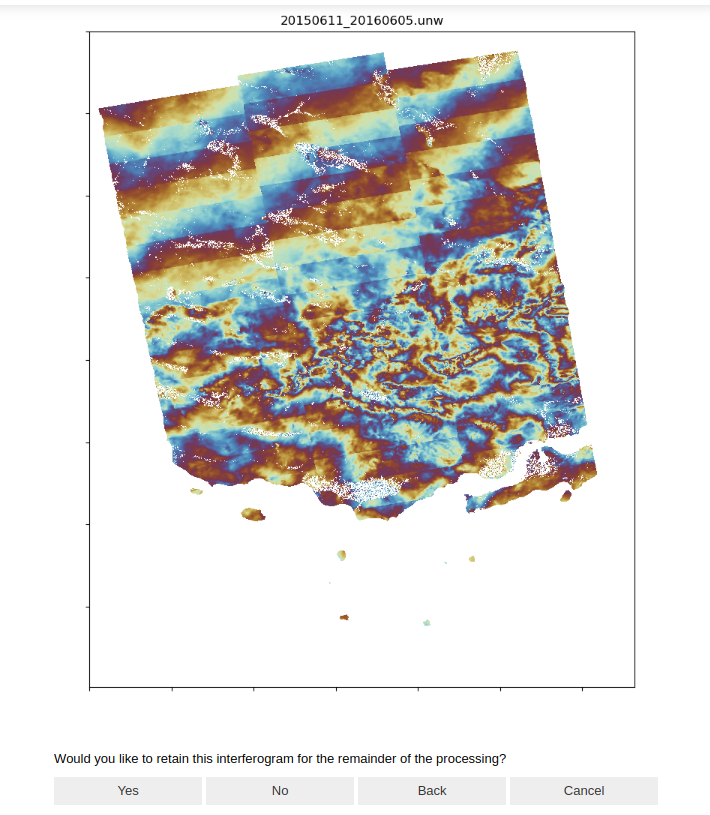

# (LicSBAS) Remove Bad Interferograms


You can employ this code to sequentially open images and subsequently exclude each of them for the remaining steps of LicSBAS processing. Execute this code within a Jupyter Notebook environment.

## Overview
This script is designed to process and manage interferograms. It displays images, allows the user to retain or move the interferograms to a specified directory, and offers navigation options through the images.
COMET products are invaluable tools for InSAR processing. While LiCSBAS is effective at removing bad interferograms through accurate analysis, it can sometimes fail to detect specific bad interferograms, especially those with burst and swath errors. As a result, the final output may be contaminated by these effects.

This code provides a solution to that problem. It allows you to open each PNG-formatted unwrapped interferogram individually, view it, and remove it from processing with just one click if needed. The bad interferograms will be saved in a separate folder for your reference.

Please make sure to run this code in the main folder where you have both batch_LiCSBAS.sh and the GEOCml1 folder. Then, proceed with step three and follow the instructions 

## Prerequisites
The script requires the following libraries:

- `os`
- `shutil`
- `ipywidgets`
- `IPython`
- `PIL` (Pillow)

Please ensure that you have these libraries installed in your Python environment before running the script.

## Installation
1. Clone the repository to your local machine.
2. Navigate to the directory containing the script.
3. Install the necessary libraries using the following commands:
   ```bash
   pip install ipywidgets
   pip install pillow

    Make sure you have the required directories and files as specified in the script (base_dir, bad_ifgs_dir, etc.).

Usage

    Open a Jupyter Notebook or IPython environment.
    Import the script or copy and paste the code into a notebook cell.
    Run the script.



The script will display the interferogram images and allow you to navigate through them, retain them, or move them to a specified directory as per your selection.


Feel free to modify or expand this template to suit your project's needs.

## Written by
Mohammadhoosein Mohamamdnia  
Email: mhmnia@connect.hku.hk  
Date: 7-20-2023
